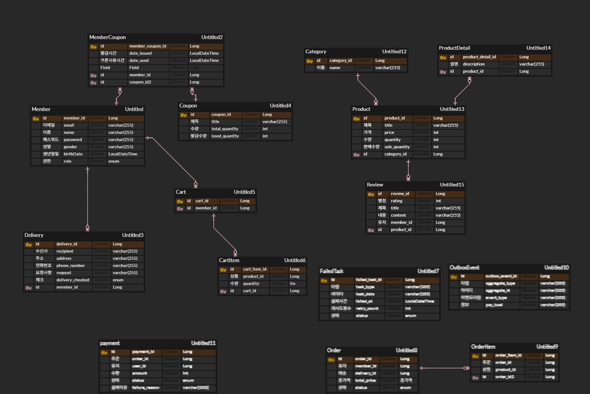
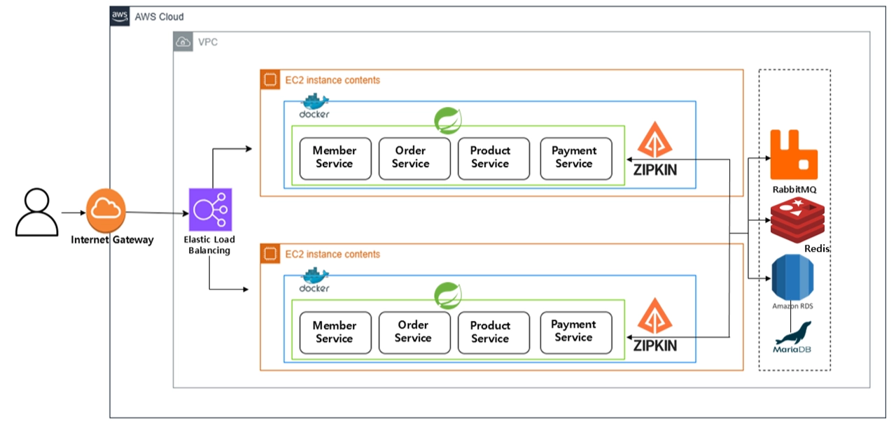

## Store

쇼핑몰 프로젝트 Store

---

## 프로젝트 소개

**모놀리틱 아키텍처에서 마이크로서비스로 전환**하여 구축한 Spring Cloud 기반 쇼핑몰 서비스입니다.

### 🎯 주요 특징
- 모놀리틱에서 마이크로서비스 아키텍처로의 전환
- Zipkin을 활용한 성능 병목 지점 발견 및 최적화
- 이벤트 기반 비동기 통신 구조 설계 (RabbitMQ)
- 분산 트랜잭션 관리 (Saga Pattern + Outbox Pattern)
- 서비스 안정성 패턴 (Circuit Breaker, Retry, Fallback)
- 클라우드 네이티브 애플리케이션 개발 (Kubernetes)
- AWS EKS, RDS 배포

## ERD

---

## 시스템 아키텍처

---

## 주요 개선 성과
1. 모놀리틱에서 마이크로서비스로의 전환
   - 빌드 시간 : 12초 → 6초(50% 단축)
2. ZipKin을 통한 성능 병목 지점 발견 및 최적화
    - Span 개수 : **61→ 55개(10% 감소)**
   - 전체 소요 시간 : **208ms → 158ms(24% 개선)**
3. Circuit Breaker를 통한 장애 전파 차단
    - 실패 시 DB에 저장 시간 : 17초 → 0.01초(1700배 개선)
4. Feign(동기 통신)에서 RabbitMQ(비동기 통신)으로 전환
    - 응답 시간
      - 5초내에 100명의 사용자가 주문을 하는 경우
      - 평균 응답 시간 : **57ms → 37ms(36% 개선)**
      - p95 응답 시간 : **162ms → 80ms(50% 개선)**
5. Outbox Pattern
    - 주문 DB 저장 실패 시 장바구니 비우기를 시도하지 않아서 정합성 보장
6. Saga Pattern으로 보상 트랜잭션 구현
    - 재고는 결제 성공 후에만 차감되어 데이터 정합성 보장
7. AWS EKS를 통한 배포