# MSA E-Commerce Platform

Spring Boot 기반 마이크로서비스 이커머스 플랫폼입니다. AI 연동, Kubernetes 배포를 포함한 클라우드 네이티브 아키텍처로 구성되어 있습니다.

---

## 목차

1. [서비스 구성](#서비스-구성)
2. [전체 시스템 아키텍처](#전체-시스템-아키텍처)
3. [기술 스택](#기술-스택)
4. [서비스별 상세](#서비스별-상세)
5. [ERD](#erd)
6. [메시지 브로커 아키텍처](#메시지-브로커-아키텍처)
7. [데이터 흐름도](#데이터-흐름도)
8. [인프라 아키텍처](#인프라-아키텍처)
9. [보안 구조](#보안-구조)
10. [성능 개선 결과](#성능-개선-결과)
11. [실행 방법](#실행-방법)

---

## 서비스 구성

| 서비스 | 언어/프레임워크 | 포트 | 역할 |
|--------|----------------|------|------|
| `discovery-service` | Spring Boot (Eureka) | 8761 | 서비스 레지스트리 |
| `gate-way` | Spring Cloud Gateway | 8000 | API 게이트웨이, JWT 인증 |
| `member` | Spring Boot | 8080 | 회원, 장바구니, 쿠폰, 배송지 |
| `order` | Spring Boot | 8080 | 주문, 정산 |
| `payment` | Spring Boot | 8080 | 결제 (Toss Payments 연동) |
| `product` | Spring Boot | 8080 | 상품, 리뷰, 카테고리, 랭킹 |

---

## 전체 시스템 아키텍처

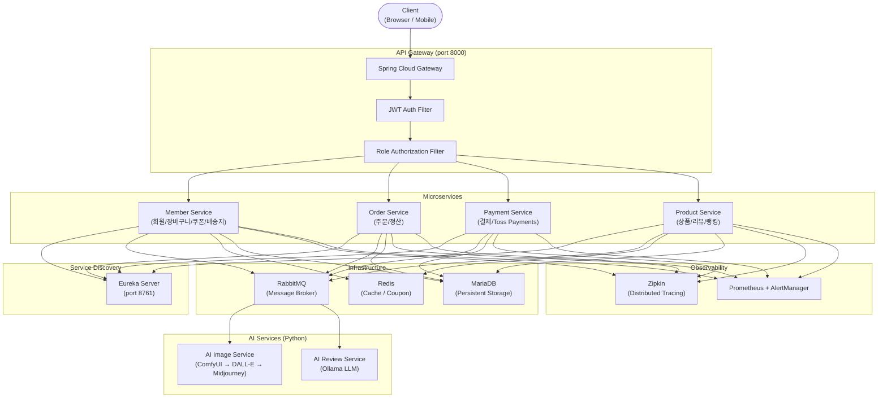
```mermaid
graph TB
    Client(["Client\n(Browser / Mobile)"])

    subgraph Gateway["API Gateway (port 8000)"]
        GW["Spring Cloud Gateway"]
        JWT["JWT Auth Filter"]
        ROLE["Role Authorization Filter"]
    end

    subgraph Discovery["Service Discovery"]
        EUREKA["Eureka Server\n(port 8761)"]
    end

    subgraph Services["Microservices"]
        MEMBER["Member Service\n(회원/장바구니/쿠폰/배송지)"]
        ORDER["Order Service\n(주문/정산)"]
        PAYMENT["Payment Service\n(결제/Toss Payments)"]
        PRODUCT["Product Service\n(상품/리뷰/랭킹)"]
    end

    subgraph AI["AI Services (Python)"]
        AI_IMG["AI Image Service\n(ComfyUI → DALL-E → Midjourney)"]
        AI_REV["AI Review Service\n(Ollama LLM)"]
    end

    subgraph Infra["Infrastructure"]
        MQ["RabbitMQ\n(Message Broker)"]
        REDIS["Redis\n(Cache / Coupon)"]
        DB["MariaDB\n(Persistent Storage)"]
    end

    subgraph Monitoring["Observability"]
        ZIPKIN["Zipkin\n(Distributed Tracing)"]
        PROM["Prometheus + AlertManager"]
    end

    Client --> GW
    GW --> JWT --> ROLE
    ROLE --> MEMBER & ORDER & PAYMENT & PRODUCT

    MEMBER & ORDER & PAYMENT & PRODUCT --> EUREKA

    ORDER & PAYMENT & PRODUCT & MEMBER --> MQ
    MQ --> AI_IMG & AI_REV

    MEMBER --> REDIS
    PRODUCT --> REDIS
    MEMBER & ORDER & PAYMENT & PRODUCT --> DB

    MEMBER & ORDER & PAYMENT & PRODUCT --> ZIPKIN
    MEMBER & ORDER & PAYMENT & PRODUCT --> PROM
```

---

## 기술 스택

### Backend
| 분류 | 기술 |
|------|------|
| Framework | Spring Boot 3.2+, Spring Cloud 2023.0+ |
| Service Discovery | Spring Cloud Netflix Eureka |
| API Gateway | Spring Cloud Gateway (WebFlux) |
| ORM | Spring Data JPA / Hibernate (MariaDB Dialect) |
| Messaging | Spring AMQP (RabbitMQ) |
| Cache | Spring Data Redis |
| HTTP Client | Spring Cloud OpenFeign |
| Fault Tolerance | Resilience4j (Circuit Breaker) |
| Batch | Spring Batch |
| Auth | JWT (jjwt) |
| Observability | Micrometer Tracing + Brave + Zipkin |
| Build | Gradle (JDK 17 Temurin) |

### Infrastructure
| 분류 | 기술 |
|------|------|
| Container | Docker, Docker Compose |
| Orchestration | Kubernetes (AWS EKS) |
| GitOps | ArgoCD |
| CI/CD | GitHub Actions |
| DB | MariaDB 8.0 |
| Cache/Queue | Redis 7, RabbitMQ 3-management |
| Tracing | Zipkin (OpenZipkin) |
| Monitoring | Prometheus, AlertManager |
| Storage | AWS S3 (이미지) |

---

## 서비스별 상세

### API Gateway

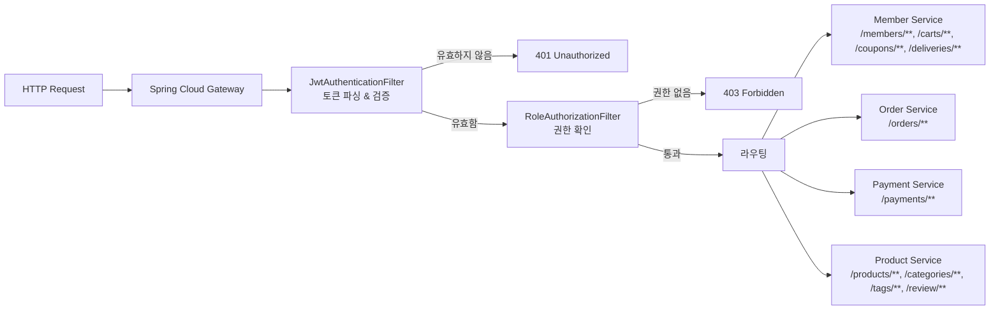
```mermaid
flowchart LR
    REQ["HTTP Request"] --> GW["Spring Cloud Gateway"]

    GW --> JWT_FILTER["JwtAuthenticationFilter\n토큰 파싱 & 검증"]
    JWT_FILTER -->|"유효하지 않음"| REJECT["401 Unauthorized"]
    JWT_FILTER -->|"유효함"| ROLE_FILTER["RoleAuthorizationFilter\n권한 확인"]
    ROLE_FILTER -->|"권한 없음"| FORBIDDEN["403 Forbidden"]
    ROLE_FILTER -->|"통과"| ROUTE["라우팅"]

    ROUTE --> MS["Member Service\n/members/**, /carts/**, /coupons/**, /deliveries/**"]
    ROUTE --> OS["Order Service\n/orders/**"]
    ROUTE --> PS["Payment Service\n/payments/**"]
    ROUTE --> PRS["Product Service\n/products/**, /categories/**, /tags/**, /review/**"]
```

**공개 엔드포인트 (인증 불필요):**
- `GET /products/**`, `GET /categories/**`, `GET /tags/**`
- `POST /members/signup`, `POST /members/login`

---

---

## ERD

### Member 서비스 ERD

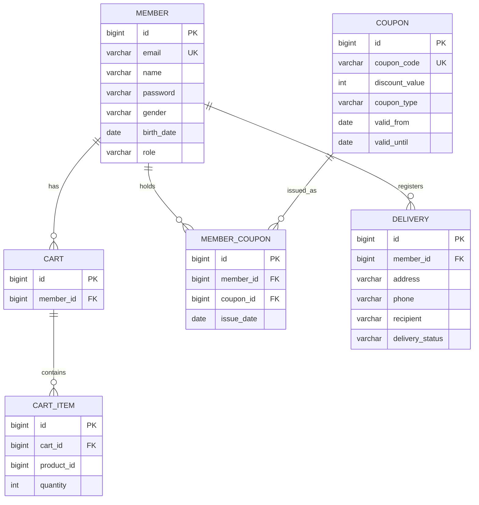
```mermaid
erDiagram
    MEMBER {
        bigint id PK
        varchar email UK
        varchar name
        varchar password
        varchar gender
        date birth_date
        varchar role
    }

    CART {
        bigint id PK
        bigint member_id FK
    }

    CART_ITEM {
        bigint id PK
        bigint cart_id FK
        bigint product_id
        int quantity
    }

    COUPON {
        bigint id PK
        varchar coupon_code UK
        int discount_value
        varchar coupon_type
        date valid_from
        date valid_until
    }

    MEMBER_COUPON {
        bigint id PK
        bigint member_id FK
        bigint coupon_id FK
        date issue_date
    }

    DELIVERY {
        bigint id PK
        bigint member_id FK
        varchar address
        varchar phone
        varchar recipient
        varchar delivery_status
    }

    MEMBER ||--o{ CART : "has"
    CART ||--o{ CART_ITEM : "contains"
    MEMBER ||--o{ MEMBER_COUPON : "holds"
    COUPON ||--o{ MEMBER_COUPON : "issued_as"
    MEMBER ||--o{ DELIVERY : "registers"
```

---

### Order 서비스 ERD

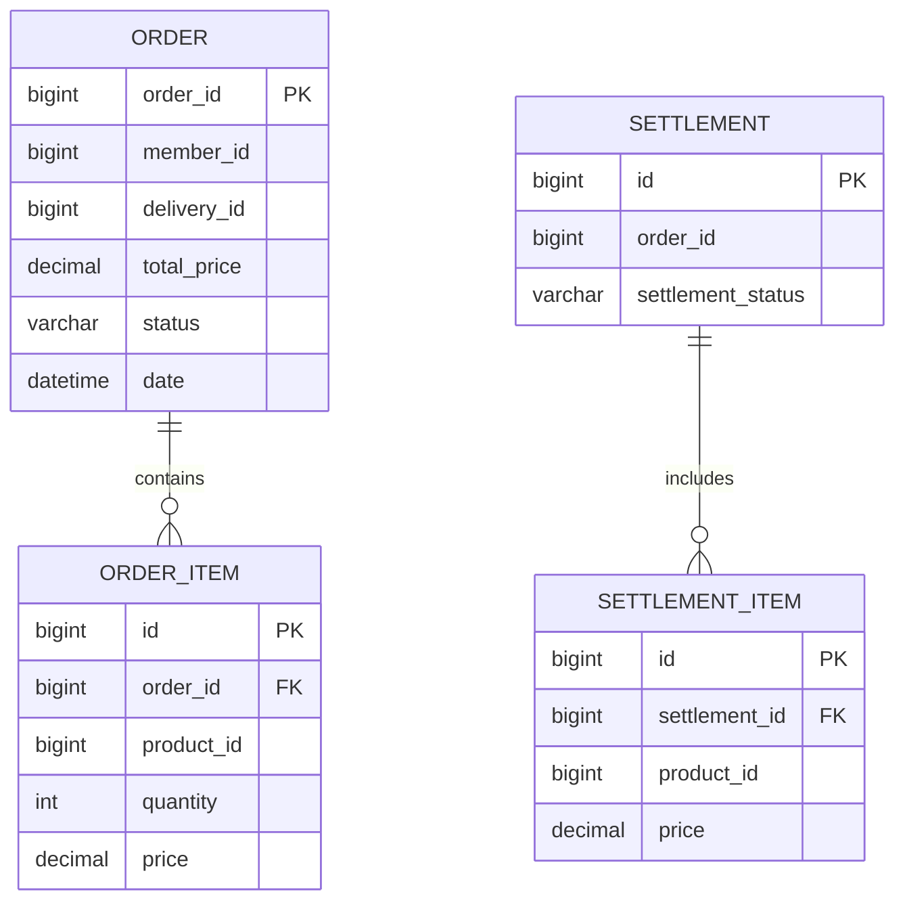
```mermaid
erDiagram
    ORDER {
        bigint order_id PK
        bigint member_id
        bigint delivery_id
        decimal total_price
        varchar status
        datetime date
    }

    ORDER_ITEM {
        bigint id PK
        bigint order_id FK
        bigint product_id
        int quantity
        decimal price
    }

    SETTLEMENT {
        bigint id PK
        bigint order_id
        varchar settlement_status
    }

    SETTLEMENT_ITEM {
        bigint id PK
        bigint settlement_id FK
        bigint product_id
        decimal price
    }

    ORDER ||--o{ ORDER_ITEM : "contains"
    SETTLEMENT ||--o{ SETTLEMENT_ITEM : "includes"
```

---

### Product 서비스 ERD

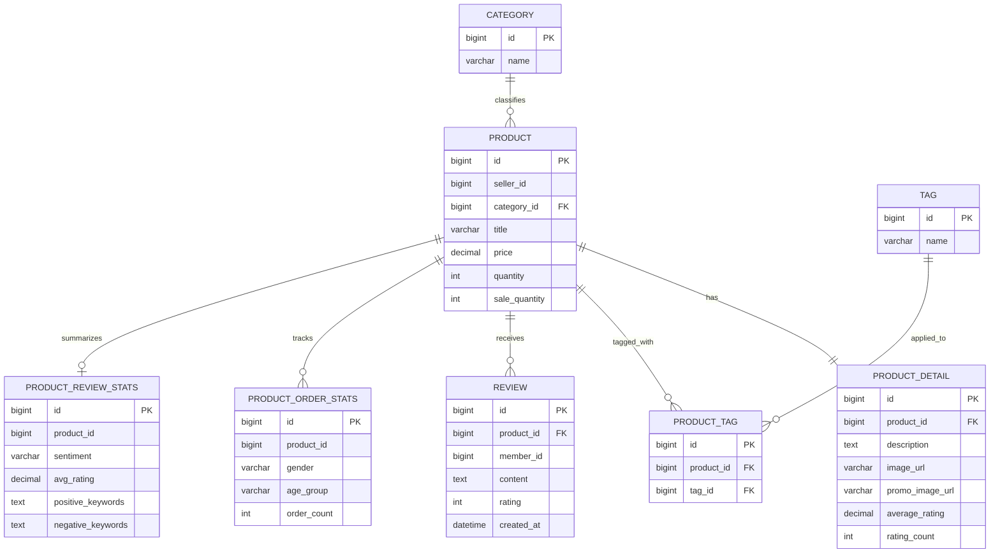
```mermaid
erDiagram
    CATEGORY {
        bigint id PK
        varchar name
    }

    PRODUCT {
        bigint id PK
        bigint seller_id
        bigint category_id FK
        varchar title
        decimal price
        int quantity
        int sale_quantity
    }

    PRODUCT_DETAIL {
        bigint id PK
        bigint product_id FK
        text description
        varchar image_url
        varchar promo_image_url
        decimal average_rating
        int rating_count
    }

    TAG {
        bigint id PK
        varchar name
    }

    PRODUCT_TAG {
        bigint id PK
        bigint product_id FK
        bigint tag_id FK
    }

    REVIEW {
        bigint id PK
        bigint product_id FK
        bigint member_id
        text content
        int rating
        datetime created_at
    }

    PRODUCT_ORDER_STATS {
        bigint id PK
        bigint product_id
        varchar gender
        varchar age_group
        int order_count
    }

    PRODUCT_REVIEW_STATS {
        bigint id PK
        bigint product_id
        varchar sentiment
        decimal avg_rating
        text positive_keywords
        text negative_keywords
    }

    CATEGORY ||--o{ PRODUCT : "classifies"
    PRODUCT ||--|| PRODUCT_DETAIL : "has"
    PRODUCT ||--o{ PRODUCT_TAG : "tagged_with"
    TAG ||--o{ PRODUCT_TAG : "applied_to"
    PRODUCT ||--o{ REVIEW : "receives"
    PRODUCT ||--o{ PRODUCT_ORDER_STATS : "tracks"
    PRODUCT ||--o| PRODUCT_REVIEW_STATS : "summarizes"
```

---

### Payment 서비스 ERD

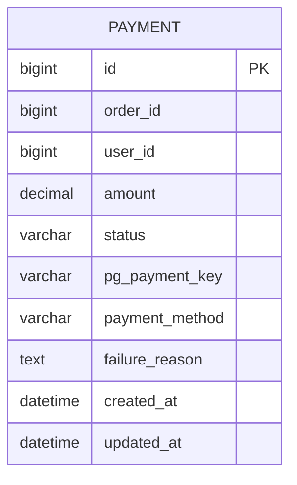
```mermaid
erDiagram
    PAYMENT {
        bigint id PK
        bigint order_id
        bigint user_id
        decimal amount
        varchar status
        varchar pg_payment_key
        varchar payment_method
        text failure_reason
        datetime created_at
        datetime updated_at
    }
```

---

## 메시지 브로커 아키텍처

### Exchange / Queue 구조

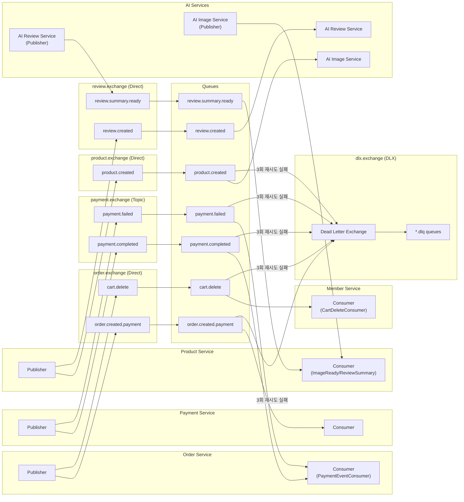
```mermaid
graph LR
    subgraph "Order Service"
        OS_PUB["Publisher"]
        OS_CON["Consumer\n(PaymentEventConsumer)"]
    end

    subgraph "order.exchange (Direct)"
        OE_OP["order.created.payment"]
        OE_CD["cart.delete"]
    end

    subgraph "Queues"
        Q_OCP["order.created.payment"]
        Q_CD["cart.delete"]
        Q_PC["payment.completed"]
        Q_PF["payment.failed"]
        Q_PRC["product.created"]
        Q_RC["review.created"]
        Q_RS["review.summary.ready"]
    end

    subgraph "payment.exchange (Topic)"
        PE_PC["payment.completed"]
        PE_PF["payment.failed"]
    end

    subgraph "product.exchange (Direct)"
        PRE_PC["product.created"]
    end

    subgraph "review.exchange (Direct)"
        RE_RC["review.created"]
        RE_RS["review.summary.ready"]
    end

    subgraph "Payment Service"
        PAY_CON["Consumer"]
        PAY_PUB["Publisher"]
    end

    subgraph "Member Service"
        MEM_CON["Consumer\n(CartDeleteConsumer)"]
    end

    subgraph "Product Service"
        PRD_PUB["Publisher"]
        PRD_CON["Consumer\n(ImageReady/ReviewSummary)"]
    end

    subgraph "AI Services"
        AI_IMG_CON["AI Image Service"]
        AI_REV_CON["AI Review Service"]
        AI_REV_PUB["AI Review Service\n(Publisher)"]
        AI_IMG_PUB["AI Image Service\n(Publisher)"]
    end

    subgraph "dlx.exchange (DLX)"
        DLX["Dead Letter Exchange"]
        DLQ["*.dlq queues"]
    end

    OS_PUB --> OE_OP --> Q_OCP --> PAY_CON
    OS_PUB --> OE_CD --> Q_CD --> MEM_CON

    PAY_PUB --> PE_PC --> Q_PC --> OS_CON
    PAY_PUB --> PE_PF --> Q_PF --> OS_CON

    PRD_PUB --> PRE_PC --> Q_PRC --> AI_IMG_CON
    PRD_PUB --> RE_RC --> Q_RC --> AI_REV_CON

    AI_IMG_PUB --> PRD_CON
    AI_REV_PUB --> RE_RS --> Q_RS --> PRD_CON

    Q_OCP & Q_CD & Q_PC & Q_PF & Q_PRC -->|"3회 재시도 실패"| DLX --> DLQ
```

### RabbitMQ 설정 요약

| Exchange | Type | 바인딩 큐 |
|----------|------|-----------|
| `order.exchange` | Direct | `order.created.payment`, `cart.delete` |
| `payment.exchange` | Topic | `payment.completed`, `payment.failed` |
| `product.exchange` | Direct | `product.created` |
| `review.exchange` | Direct | `review.created`, `review.summary.ready` |
| `dlx.exchange` | Direct | `*.dlq` (모든 실패 메시지) |

**신뢰성 설정:**
- Publisher Confirms (CorrelationData) — 발행 확인
- Prefetch Count: Java 서비스 10, AI 서비스 1 (GPU 최적화)
- 재시도: 최대 3회, 지수 백오프 (1s → 2s → 4s, max 10s)
- 실패 시 DLX → DLQ 자동 라우팅

---

## 데이터 흐름도

### 1. 주문 생성 ~ 결제 완료

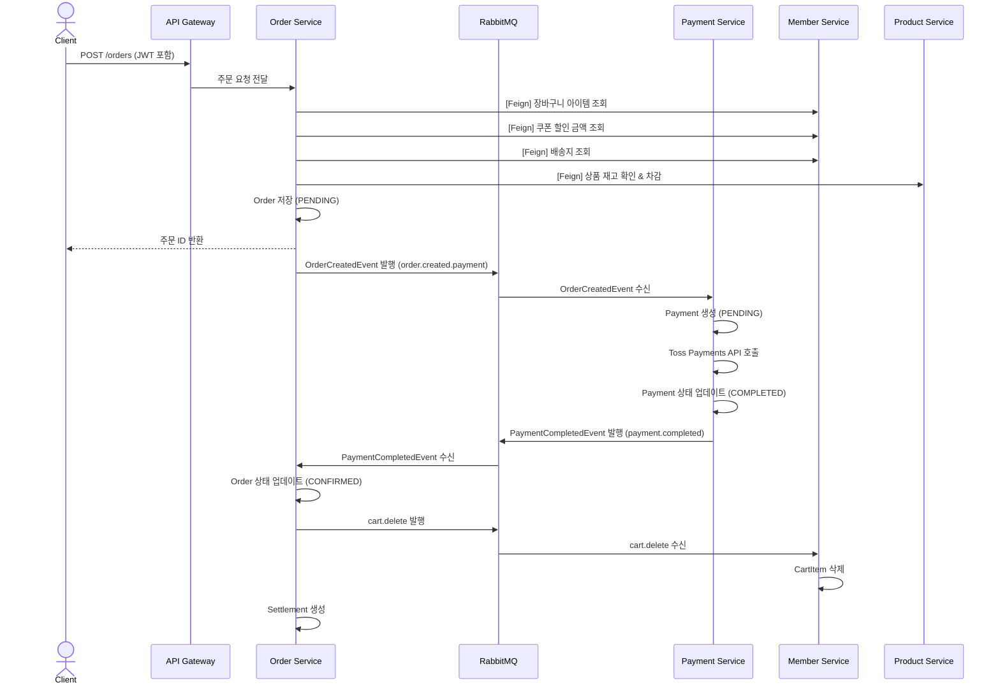
```mermaid
sequenceDiagram
    actor Client
    participant GW as API Gateway
    participant OS as Order Service
    participant MQ as RabbitMQ
    participant PS as Payment Service
    participant MS as Member Service
    participant PRS as Product Service

    Client->>GW: POST /orders (JWT 포함)
    GW->>OS: 주문 요청 전달

    OS->>MS: [Feign] 장바구니 아이템 조회
    OS->>MS: [Feign] 쿠폰 할인 금액 조회
    OS->>MS: [Feign] 배송지 조회
    OS->>PRS: [Feign] 상품 재고 확인 & 차감

    OS->>OS: Order 저장 (PENDING)
    OS-->>Client: 주문 ID 반환

    OS->>MQ: OrderCreatedEvent 발행 (order.created.payment)
    MQ->>PS: OrderCreatedEvent 수신

    PS->>PS: Payment 생성 (PENDING)
    PS->>PS: Toss Payments API 호출
    PS->>PS: Payment 상태 업데이트 (COMPLETED)
    PS->>MQ: PaymentCompletedEvent 발행 (payment.completed)

    MQ->>OS: PaymentCompletedEvent 수신
    OS->>OS: Order 상태 업데이트 (CONFIRMED)
    OS->>MQ: cart.delete 발행

    MQ->>MS: cart.delete 수신
    MS->>MS: CartItem 삭제

    OS->>OS: Settlement 생성
```

---

### 2. 쿠폰 발급 (Redis 분산 처리)

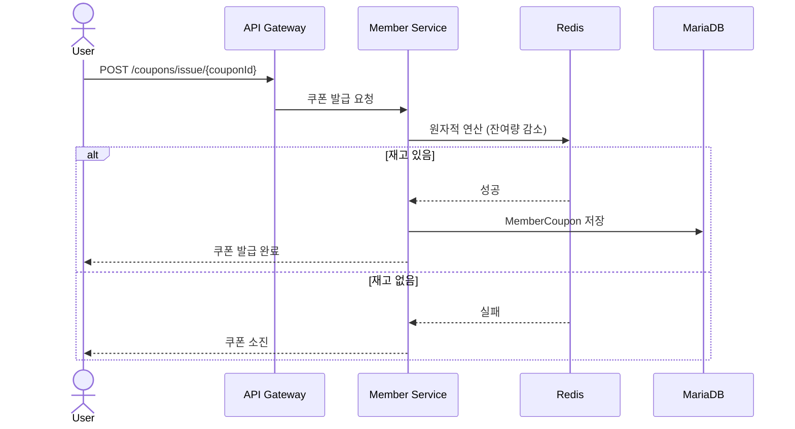
```mermaid
sequenceDiagram
    actor User
    participant GW as API Gateway
    participant MS as Member Service
    participant REDIS as Redis
    participant DB as MariaDB

    User->>GW: POST /coupons/issue/{couponId}
    GW->>MS: 쿠폰 발급 요청

    MS->>REDIS: 원자적 연산 (잔여량 감소)

    alt 재고 있음
        REDIS-->>MS: 성공
        MS->>DB: MemberCoupon 저장
        MS-->>User: 쿠폰 발급 완료
    else 재고 없음
        REDIS-->>MS: 실패
        MS-->>User: 쿠폰 소진
    end
```

---

## 인프라 아키텍처

### Kubernetes 배포 구조 (AWS EKS)

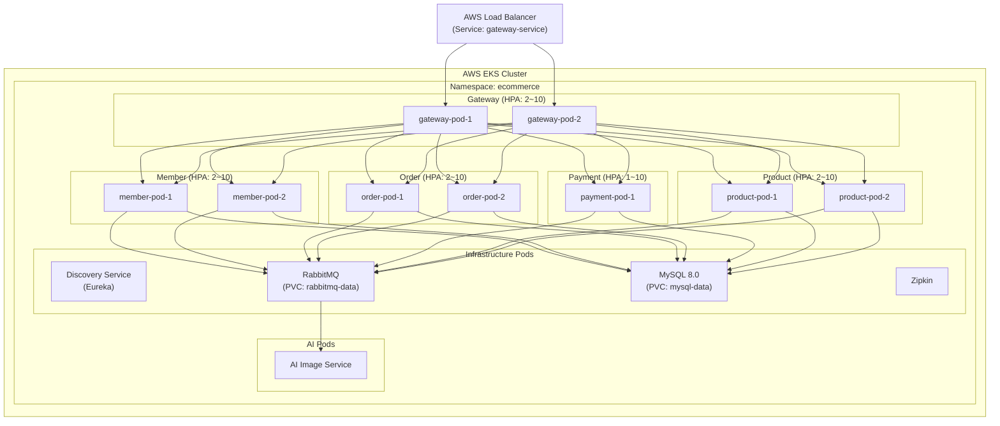
```mermaid
graph TB
    subgraph EKS["AWS EKS Cluster"]
        subgraph NS["Namespace: ecommerce"]
            subgraph GW_POD["Gateway (HPA: 2~10)"]
                GW1["gateway-pod-1"]
                GW2["gateway-pod-2"]
            end

            subgraph MEM_POD["Member (HPA: 2~10)"]
                MEM1["member-pod-1"]
                MEM2["member-pod-2"]
            end

            subgraph ORD_POD["Order (HPA: 2~10)"]
                ORD1["order-pod-1"]
                ORD2["order-pod-2"]
            end

            subgraph PAY_POD["Payment (HPA: 1~10)"]
                PAY1["payment-pod-1"]
            end

            subgraph PRD_POD["Product (HPA: 2~10)"]
                PRD1["product-pod-1"]
                PRD2["product-pod-2"]
            end

            subgraph INF["Infrastructure Pods"]
                DISC["Discovery Service\n(Eureka)"]
                MQ_POD["RabbitMQ\n(PVC: rabbitmq-data)"]
                MYSQL_POD["MySQL 8.0\n(PVC: mysql-data)"]
                ZIP_POD["Zipkin"]
            end

            subgraph AI_POD["AI Pods"]
                AI_IMG_POD["AI Image Service"]
            end
        end
    end

    LB["AWS Load Balancer\n(Service: gateway-service)"]
    LB --> GW1 & GW2

    GW1 & GW2 --> MEM1 & MEM2
    GW1 & GW2 --> ORD1 & ORD2
    GW1 & GW2 --> PAY1
    GW1 & GW2 --> PRD1 & PRD2

    MEM1 & MEM2 & ORD1 & ORD2 & PAY1 & PRD1 & PRD2 --> MQ_POD
    MEM1 & MEM2 & ORD1 & ORD2 & PAY1 & PRD1 & PRD2 --> MYSQL_POD
    MQ_POD --> AI_IMG_POD
```

### HPA (Horizontal Pod Autoscaler) 설정

| 서비스 | Min | Max | CPU 임계값 | 메모리 임계값 | Scale Up | Scale Down |
|--------|-----|-----|-----------|--------------|----------|------------|
| Gateway | 2 | 10 | 70% | 80% | 기본 | 기본 |
| Member | 2 | 10 | 70% | 80% | 기본 | 기본 |
| Order | 2 | 10 | 70% | 80% | 30s | 5min |
| Payment | 1 | 10 | 70% | 80% | 기본 | 기본 |
| Product | 2 | 10 | 70% | 80% | 기본 | 기본 |

### CI/CD Pipeline

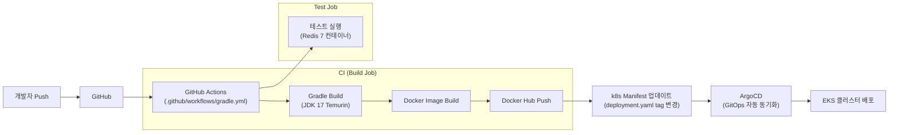
```mermaid
flowchart LR
    DEV["개발자 Push"] --> GH["GitHub"]
    GH --> GHA["GitHub Actions\n(.github/workflows/gradle.yml)"]

    subgraph CI["CI (Build Job)"]
        GHA --> BUILD["Gradle Build\n(JDK 17 Temurin)"]
        BUILD --> DOCKER_BUILD["Docker Image Build"]
        DOCKER_BUILD --> PUSH["Docker Hub Push"]
    end

    subgraph TEST["Test Job"]
        GHA --> TEST_RUN["테스트 실행\n(Redis 7 컨테이너)"]
    end

    PUSH --> K8S_UPDATE["k8s Manifest 업데이트\n(deployment.yaml tag 변경)"]
    K8S_UPDATE --> ARGOCD["ArgoCD\n(GitOps 자동 동기화)"]
    ARGOCD --> EKS["EKS 클러스터 배포"]
```

---

## 보안 구조

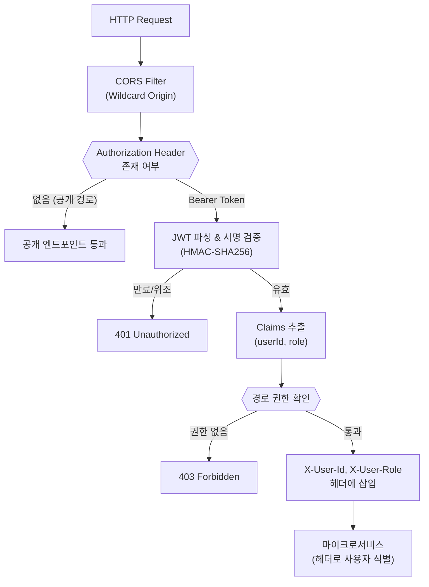
```mermaid
flowchart TD
    REQ["HTTP Request"] --> CORS["CORS Filter\n(Wildcard Origin)"]
    CORS --> JWT_CHECK{{"Authorization Header\n존재 여부"}}

    JWT_CHECK -->|"없음 (공개 경로)"| PUBLIC["공개 엔드포인트 통과"]
    JWT_CHECK -->|"Bearer Token"| JWT_VALIDATE["JWT 파싱 & 서명 검증\n(HMAC-SHA256)"]

    JWT_VALIDATE -->|"만료/위조"| ERR401["401 Unauthorized"]
    JWT_VALIDATE -->|"유효"| CLAIMS["Claims 추출\n(userId, role)"]

    CLAIMS --> ROLE_CHECK{{"경로 권한 확인"}}
    ROLE_CHECK -->|"권한 없음"| ERR403["403 Forbidden"]
    ROLE_CHECK -->|"통과"| HEADER["X-User-Id, X-User-Role\n헤더에 삽입"]

    HEADER --> SERVICE["마이크로서비스\n(헤더로 사용자 식별)"]
```

**JWT 설정:**
- 알고리즘: HMAC-SHA256
- 유효시간: 24시간 (86400000ms)
- 전달 방식: `Authorization: Bearer <token>` 헤더
- 서비스 간 사용자 식별: `X-User-Id`, `X-User-Role` 헤더

---

## 성능 개선 결과

### 상품 조회 성능 개선

| # | 방법 | 문제 | 성과 |
|---|------|------|------|
| 1 | **커버링 인덱스 적용** | 750만 건 환경에서 Full Scan·filesort로 응답 지연 (2.5s) | filesort·임시 테이블 제거 → **96% 단축 (2.5s → 80ms)** |
| 2 | **역정규화 + Redis Write-Behind** | 다중 JOIN + 실시간 통계 업데이트 충돌로 DB 병목 (3.8s) | **93% 단축 (3.8s → 250ms)**, DB 쓰기 N회 → 1회 |

**커버링 인덱스:** 정렬·조회 컬럼을 모두 포함한 인덱스를 설계해 테이블 재접근을 제거하고 filesort·임시 테이블을 완전히 제거

**Redis Write-Behind:** 역정규화 테이블로 읽기 부하를 분산하고 통계 업데이트는 Redis에 누적 후 10초 주기 배치로 DB에 일괄 반영해 쓰기 충돌 해소

---

### 모놀리식 → 마이크로서비스 전환

| 지표 | Before (Monolith) | After (MSA) | 개선율 |
|------|------------------|-------------|--------|
| 빌드 시간 | 12s | 6s | **50% 감소** |
| Zipkin Span 수 | 61 | 55 | **10% 감소** |
| 평균 응답 시간 | 208ms | 158ms | **24% 개선** |
| Circuit Breaker 처리 | 17s (타임아웃) | 0.01s (즉시 차단) | **1700x 개선** |

### RabbitMQ 비동기 처리 도입 후

| 지표 | Before (동기) | After (비동기) | 개선율 |
|------|--------------|---------------|--------|
| 평균 응답 시간 | 57ms | 37ms | **36% 개선** |
| P95 응답 시간 | 162ms | 80ms | **50% 개선** |

### 신뢰성 패턴

| 패턴 | 목적 | 효과 |
|------|------|------|
| Circuit Breaker | 장애 격리 | Cascade Failure 방지 |
| DLX/DLQ | 메시지 재처리 | 메시지 유실 없이 재시도 |
| Publisher Confirms | 발행 확인 | 브로커 장애 시 재발행 |
| Cache-Aside (Redis) | 읽기 성능 | DB 부하 감소 |

---

## 실행 방법

### 로컬 개발 환경 (Docker Compose)

```bash
# 인프라 서비스 시작 (DB, Redis, RabbitMQ, Zipkin)
docker-compose -f docker-compose-msa.yml up -d mysql redis rabbitmq zipkin

# 서비스 디스커버리 시작
docker-compose -f docker-compose-msa.yml up -d discovery-service

# 전체 서비스 시작
docker-compose -f docker-compose-msa.yml up -d
```

### Kubernetes 배포 (EKS)

```bash
# 네임스페이스 생성
kubectl create namespace ecommerce

# Secrets & ConfigMap 적용
kubectl apply -f k8s/config/ -n ecommerce

# 인프라 서비스 배포
kubectl apply -f k8s/services/mysql/ -n ecommerce
kubectl apply -f k8s/services/rabbitmq/ -n ecommerce
kubectl apply -f k8s/services/zipkin/ -n ecommerce

# 애플리케이션 배포
kubectl apply -f k8s/services/ -n ecommerce

# 배포 스크립트 사용
bash k8s/deploy.sh
```

### 환경 변수 (주요)

| 변수 | 설명 | 기본값 |
|------|------|--------|
| `SPRING_DATASOURCE_URL` | MariaDB 연결 URL | `jdbc:mariadb://localhost:3306/store` |
| `SPRING_RABBITMQ_HOST` | RabbitMQ 호스트 | `localhost` |
| `SPRING_REDIS_HOST` | Redis 호스트 | `localhost` |
| `JWT_SECRET` | JWT 서명 키 | (application.yml) |
| `TOSS_PAYMENTS_SECRET` | Toss Payments 시크릿 | - |
| `OPENAI_API_KEY` | OpenAI DALL-E 키 | - |
| `AWS_S3_BUCKET` | S3 버킷명 | - |
| `OLLAMA_URL` | Ollama 서버 URL | - |

---

## 프로젝트 구조

```
store/
├── discovery-service/          # Eureka 서비스 디스커버리
├── gate-way/                   # Spring Cloud Gateway (인증/라우팅)
├── member/                     # 회원/장바구니/쿠폰/배송지
├── order/                      # 주문/정산
├── payment/                    # 결제 (Toss Payments)
├── product/                    # 상품/리뷰/랭킹/카테고리
├── ai-image-service/           # Python AI 이미지 생성
├── ai-review-service/          # Python AI 리뷰 감성 분석
├── k8s/                        # Kubernetes 매니페스트 (EKS)
│   ├── services/               # 각 서비스별 Deployment/Service/HPA
│   └── deploy.sh               # 배포 스크립트
├── monitoring/                 # Prometheus / AlertManager 설정
├── db/                         # MySQL 초기화 스크립트
├── docker-compose-msa.yml      # 로컬 개발용 Docker Compose
└── .github/workflows/          # GitHub Actions CI/CD
```
